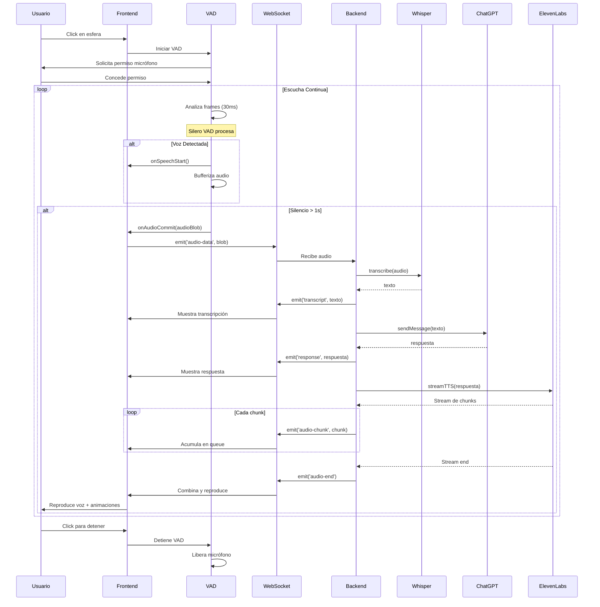

# 🏗️ ARCHITECTURE - H.E.L.E.N

**Documentación Técnica Completa**

## 📋 Tabla de Contenidos

1. [Visión General](#visión-general)
2. [Stack Tecnológico](#stack-tecnológico)
3. [Arquitectura del Sistema](#arquitectura-del-sistema)
4. [Componentes Frontend](#componentes-frontend)
5. [Componentes Backend](#componentes-backend)
6. [Flujo de Datos](#flujo-de-datos)
7. [APIs y Servicios Externos](#apis-y-servicios-externos)
8. [Optimizaciones y Decisiones de Diseño](#optimizaciones-y-decisiones-de-diseño)
9. [Seguridad](#seguridad)
10. [Escalabilidad](#escalabilidad)

---

## 🎯 Visión General

H.E.L.E.N es una arquitectura de **microservicios ligeros** con comunicación en tiempo real mediante WebSocket. Sigue principios de:

- **Separación de responsabilidades** (Frontend/Backend)
- **Event-driven architecture** (basada en eventos)
- **Streaming de datos** (audio real-time)
- **Stateless backend** (sin estado en el servidor)
- **Client-side state management** (estado en el cliente)

### Diagrama de Alto Nivel

```
┌─────────────────────────────────────────────────────────────────┐
│                          USUARIO                                 │
│                            ↕                                     │
│                    ┌──────────────┐                              │
│                    │   BROWSER    │                              │
│                    │  (Frontend)  │                              │
│                    └──────────────┘                              │
│                            ↕                                     │
│                        WebSocket                                 │
│                            ↕                                     │
│                    ┌──────────────┐                              │
│                    │  Node.js     │                              │
│                    │  (Backend)   │                              │
│                    └──────────────┘                              │
│                     ↙     ↓      ↘                               │
│              ┌─────┐  ┌─────┐  ┌─────┐                          │
│              │Whisp│  │Chat │  │11Labs│                          │
│              │ er  │  │ GPT │  │      │                          │
│              └─────┘  └─────┘  └─────┘                          │
│              OpenAI    OpenAI   ElevenLabs                       │
└─────────────────────────────────────────────────────────────────┘
```

---

## 🛠️ Stack Tecnológico

### Frontend

| Tecnología | Versión | Propósito |
|------------|---------|-----------|
| **Vite** | 7.2.4 | Build tool y dev server |
| **Vanilla JS** | ES2022 | Lógica de aplicación |
| **GSAP** | 3.x | Animaciones |
| **Socket.IO Client** | 4.8.1 | WebSocket client |
| **@ricky0123/vad-web** | 0.0.7 | Voice Activity Detection |
| **onnxruntime-web** | 1.14.0 | Runtime para modelo VAD |
| **SimplexNoise** | Latest | Generador de ruido |
| **Web Audio API** | Native | Procesamiento de audio |

### Backend

| Tecnología | Versión | Propósito |
|------------|---------|-----------|
| **Node.js** | ≥20.0.0 | Runtime |
| **Express** | 4.x | HTTP server |
| **Socket.IO** | 4.x | WebSocket server |
| **OpenAI SDK** | Latest | Whisper + GPT-4 |
| **ElevenLabs SDK** | Latest | Text-to-Speech |
| **Form-data** | Latest | Multipart form handling |
| **dotenv** | Latest | Environment variables |

### Infraestructura

- **Concurrently**: Ejecutar backend y frontend simultáneamente
- **Git**: Control de versiones
- **npm**: Gestión de paquetes

---

## 🏛️ Arquitectura del Sistema

### Patrón: Event-Driven + Microservicios

```
┌─────────────────────── FRONTEND ────────────────────────┐
│                                                          │
│  ┌──────────────┐     ┌──────────────┐                 │
│  │  VoiceAIApp  │────▶│ AudioCapture │                 │
│  │   (Main)     │     │    (VAD)     │                 │
│  └──────┬───────┘     └──────────────┘                 │
│         │                                                │
│         ├──────▶ AudioVisualizer                        │
│         ├──────▶ ParticleSystem                         │
│         └──────▶ Socket.IO Client                       │
│                        │                                 │
└────────────────────────┼─────────────────────────────────┘
                         │ WebSocket
┌────────────────────────┼─────────────────────────────────┐
│                        ▼                    BACKEND      │
│                ┌──────────────┐                          │
│                │ Socket.IO    │                          │
│                │   Server     │                          │
│                └──────┬───────┘                          │
│                       │                                   │
│         ┌─────────────┼─────────────┐                   │
│         │             │             │                    │
│    ┌────▼────┐  ┌────▼────┐  ┌────▼────┐              │
│    │ Whisper │  │ ChatGPT │  │11Labs │              │
│    │ Service │  │ Service │  │ Service │              │
│    └─────────┘  └─────────┘  └─────────┘              │
│                                                          │
└──────────────────────────────────────────────────────────┘
```

###Decisiones Clave de Arquitectura

1. **WebSocket over HTTP REST**
   - **Razón**: Latencia ultra-baja, conexión persistente
   - **Trade-off**: Más complejo que REST, necesita fallbacks

2. **Client-Side VAD**
   - **Razón**: Reduce carga del servidor, latencia mínima
   - **Trade-off**: Mayor carga en el navegador del cliente

3. **Stateless Backend**
   - **Razón**: Fácil de escalar horizontalmente
   - **Trade-off**: Todo el estado está en el cliente

4. **Streaming de Audio**
   - **Razón**: Reduce latencia percibida (TTFB)
   - **Trade-off**: Mayor complejidad en la reproducción

---

## 🎨 Componentes Frontend

### 1. VoiceAIApp (Main Controller)

**Archivo**: `frontend/app.js`

**Responsabilidades**:
- Coordinación general de la aplicación
- Gestión de estados (idle, listening, processing, speaking)
- Inicialización de servicios
- Event handling principal

**Diagrama de Estados**:
```
     ┌──────┐
     │ IDLE │◀───────────────┐
     └──┬───┘                │
        │ click              │
        ▼                    │
  ┌───────────┐              │
  │ LISTENING │              │
  └─────┬─────┘              │
        │ speech detected    │
        ▼                    │
 ┌──────────────┐            │
 │  PROCESSING  │            │
 └──────┬───────┘            │
        │ response ready     │
        ▼                    │
  ┌──────────┐               │
  │ SPEAKING │───────────────┘
  └──────────┘  audio ended
```

**Métodos Clave**:

```javascript
class VoiceAIApp {
    // Lifecycle
    constructor()              // Inicialización
    async init()               // Setup completo
    
    // VAD Control
    async startVADConversation()  // Inicia escucha
    async stopVADConversation()   // Detiene sistema
    
    // WebSocket
    initializeWebSocket()      // Configura Socket.IO
    sendAudioToServer(blob)    // Envía audio grabado
    
    // Audio Playback
    playAllAudioAtOnce()       // Reproduce respuesta
    
    // UI Updates
    setState(state)            // Cambia estado visual
    updateStatus(message)      // Actualiza mensaje
    updateSphereFromAudio(data) // Anima segun audio
}
```

### 2. AudioCaptureVAD (Voice Detection)

**Archivo**: `frontend/audioCapture.js`

**Responsabilidades**:
- Captura de audio del micrófono
- Detección automática de actividad de voz
- Gestión de chunks de audio
- Commit automático en silencio

**Configuración del VAD**:

```javascript
const vadConfig = {
    // Modelo ML
    model: 'silero_vad',           // Modelo Silero optimizado
    
    // Detección
    positiveSpeechThreshold: 0.5,   // 0-1, confianza mínima
    negativeSpeechThreshold: 0.35,  // Umbral para NO-voz
    
    // Timing
    redemptionFrames: 8,            // Frames para recuperar de silencio
    frameSamples: 1536,             // Muestras por frame
    
    // Procesamiento
    minSpeechFrames: 3,             // Frames mínimos para voz válida
    preSpeechPadFrames: 1,          // Padding antes de voz
    
    // Audio
    sampleRate: 16000,              // Hz (16kHz estándar)
    
    // Callbacks
    onFrameProcessed,               // Cada frame analizado
    onVADMisfire,                   // False positives
    onSpeechStart,                  // Inicio de voz
    onSpeechEnd,                    // Fin de voz
};
```

**Algoritmo de Detección**:

```javascript
/*
1. Captura frame de audio (30ms)
2. Procesa con modelo Silero VAD
3. Obtiene probabilidad de voz (0-1)
4. Si > threshold (0.5):
   - Marca como "hablando"
   - Buffer audio
5. Si < threshold y pasa tiempo (1s):
   - Marca como "silencio"
   - Commit del buffer
6. Envía audio acumulado
*/
```

### 3. AudioVisualizer (Spectrum Analysis)

**Archivo**: `frontend/audioVisualizer.js`

**Responsabilidades**:
- Análisis FFT del audio
- Extracción de frecuencias
- Datos para visualización

**Pipeline de Análisis**:

```
Audio Input
    ↓
MediaStreamSource / BufferSource
    ↓
AnalyserNode (FFT Size: 256)
    ↓
getByteFrequencyData() → Uint8Array[128]
    ↓
Normalización (0-255 → 0-1)
    ↓
Datos para Partículas/Esfera
```

**Configuración FFT**:

```javascript
{
    fftSize: 256,              // Potencia de 2
    smoothingTimeConstant: 0.8, // Suavizado (0-1)
    frequencyBinCount: 128,     // fftSize / 2
    minDecibels: -90,
    maxDecibels: -10
}
```

### 4. ParticleSystem (Visual Effects)

**Archivo**: `frontend/particleSystem.js`

**Responsabilidades**:
- Gestión de 1000+ partículas
- Movimiento basado en ruido Simplex
- Reacción a frecuencias de audio
- Rendering con requestAnimationFrame

**Algoritmo de Movimiento**:

```javascript
// Para cada partícula
particle.update(audioData, deltaTime) {
    // 1. Ruido Simplex para movimiento orgánico
    const noiseX = simplex.noise3D(x, y, time) * speed;
    const noiseY = simplex.noise3D(x, y, time + 100) * speed;
    
    // 2. Influencia del audio (frecuencia específica)
    const frequencyIndex = particle.id % 128;
    const audioInfluence = audioData[frequencyIndex] / 255;
    
    // 3. Combinar movimientos
    particle.x += noiseX + (audioInfluence * 0.5);
    particle.y += noiseY + (audioInfluence * 0.3);
    
    // 4. Bounds checking (wrap around)
    if (particle.x > bounds) particle.x = -bounds;
}
```

---

## ⚙️ Componentes Backend

### 1. Socket Handler (WebSocket Manager)

**Archivo**: `backend/routes/socketHandler.js`

**Eventos Manejados**:

| Evento | Dirección | Payload | Descripción |
|--------|-----------|---------|-------------|
| `connection` | Server | - | Cliente conectado |
| `audio-data` | Client→Server | `{audio: ArrayBuffer}` | Audio del usuario |
| `transcript` | Server→Client | `{text: string}` | Transcripción de Whisper |
| `response` | Server→Client | `{text: string}` | Respuesta de ChatGPT |
| `audio-chunk` | Server→Client | `{chunk: base64, chunkNumber}` | Chunk de TTS |
| `audio-end` | Server→Client | `{totalChunks, totalTime}` | Fin de streaming |
| `status` | Server→Client | `{message, stage}` | Estado del proceso |
| `error` | Server→Client | `{message, details}` | Error |
| `disconnect` | Both | - | Desconexión |

**Pipeline de Procesamiento**:

```javascript
async function processAudio(socket, audioData) {
    const startTime = Date.now();
    
    try {
        // 1. WHISPER - Speech to Text
        updateStatus(socket, 'whisper', 'Transcribiendo...');
        const transcript = await whisperService.transcribe(audioData);
        socket.emit('transcript', { text: transcript });
        
        // 2. CHATGPT - Generate Response
        updateStatus(socket, 'chatgpt', 'Pensando...');
        const response = await chatgptService.sendMessage(transcript);
        socket.emit('response', { text: response });
        
        // 3. ELEVENLABS - Text to Speech (STREAMING)
        updateStatus(socket, 'tts', 'Generando voz...');
        const audioStream = await elevenlabsService.streamTTS(response);
        
        // 4. CHUNK BUFFERING
        let chunkBuffer = [];
        const MIN_CHUNK_SIZE = 1000; // bytes
        
        audioStream.on('data', (chunk) => {
            chunkBuffer.push(chunk);
            const bufferSize = chunkBuffer.reduce((sum, c) => sum + c.length, 0);
            
            if (bufferSize >= MIN_CHUNK_SIZE) {
                const combined = Buffer.concat(chunkBuffer);
                socket.emit('audio-chunk', {
                    chunk: combined.toString('base64'),
                    chunkNumber: ++chunkCount,
                    mimeType: 'audio/mpeg'
                });
                chunkBuffer = [];
            }
        });
        
        audioStream.on('end', () => {
            // Flush remaining
            if (chunkBuffer.length > 0) {
                const combined = Buffer.concat(chunkBuffer);
                socket.emit('audio-chunk', {
                    chunk: combined.toString('base64'),
                    chunkNumber: ++chunkCount,
                    mimeType: 'audio/mpeg'
                });
            }
            
            socket.emit('audio-end', {
                totalChunks: chunkCount,
                totalTime: Date.now() - startTime
            });
        });
        
    } catch (error) {
        socket.emit('error', {
            message: 'Error en procesamiento',
            details: error.message,
            stage: currentStage
        });
    }
}
```

### 2. WhisperService (STT)

**Archivo**: `backend/services/WhisperService.js`

**API**: OpenAI Whisper API v1

**Configuración**:

```javascript
{
    model: 'whisper-1',
    language: 'es',           // Español
    response_format: 'json',  // Opciones: json, text, srt, vtt
    temperature: 0            // Determinístico
}
```

**Proceso**:

```javascript
async transcribe(audioBuffer) {
    // 1. Convertir Buffer a FormData
    const formData = new FormData();
    const blob = new Blob([audioBuffer], { type: 'audio/wav' });
    formData.append('file', blob, 'audio.wav');
    formData.append('model', 'whisper-1');
    formData.append('language', 'es');
    
    // 2. POST a API
    const response = await openai.audio.transcriptions.create(formData);
    
    // 3. Extraer texto
    return response.text;
}
```

**Optimizaciones**:
- Audio en formato WAV (sin compresión adicional)
- Sample rate: 16kHz (suficiente para voz)
- Mono channel (reduce tamaño)

### 3. ChatGPTService (Conversational AI)

**Archivo**: `backend/services/ChatGPTService.js`

**API**: OpenAI Assistants API

**Arquitectura de Threads**:

```
User Session
    ↓
  Thread
    ├── Message 1 (User)
    ├── Message 2 (Assistant)
    ├── Message 3 (User)
    ├── Message 4 (Assistant)
    └── ...
```

**Flujo de Conversación**:

```javascript
async sendMessage(userMessage) {
    // 1. Crear thread si no existe
    if (!this.currentThreadId) {
        const thread = await openai.beta.threads.create();
        this.currentThreadId = thread.id;
    }
    
    // 2. Añadir mensaje del usuario
    await openai.beta.threads.messages.create(this.currentThreadId, {
        role: 'user',
        content: userMessage
    });
    
    // 3. Ejecutar asistente
    const run = await openai.beta.threads.runs.create(this.currentThreadId, {
        assistant_id: this.assistantId
    });
    
    // 4. Polling hasta completar (max 30s)
    let runStatus;
    let attempts = 0;
    const maxAttempts = 60; // 30 segundos
    
    do {
        await sleep(500);
        runStatus = await openai.beta.threads.runs.retrieve(
            this.currentThreadId,
            run.id
        );
        attempts++;
    } while (
        runStatus.status !== 'completed' && 
        attempts < maxAttempts &&
        runStatus.status !== 'failed'
    );
    
    // 5. Obtener respuesta
    const messages = await openai.beta.threads.messages.list(this.currentThreadId);
    const assistantMessage = messages.data[0];
    
    return assistantMessage.content[0].text.value;
}
```

**Configuración del Asistente**:

```javascript
{
    model: 'gpt-4-turbo',
    temperature: 0.7,          // Creatividad moderada
    max_tokens: 500,           // Respuestas concisas
    instructions: `
        Eres un asistente virtual amigable y profesional.
        Responde SIEMPRE en español.
        Mantén respuestas breves para conversaciones de voz.
        Usa un tono natural y conversacional.
    `
}
```

### 4. ElevenLabsService (TTS)

**Archivo**: `backend/services/ElevenLabsService.js`

**API**: ElevenLabs TTS API v1

**Streaming Configuration**:

```javascript
{
    voice_id: 'qHkrJuifPpn95wK3rm2A',  // Carmen (español)
    model_id: 'eleven_multilingual_v2',
    voice_settings: {
        stability: 0.5,         // 0-1, más estable = menos variación
        similarity_boost: 0.75, // 0-1, similitud con voz original
        style: 0.0,             // 0-1, exageración del estilo
        use_speaker_boost: true // Mejora claridad
    },
    optimize_streaming_latency: 3  // 0-4, más alto = menor latencia
}
```

**Streaming Process**:

```javascript
async streamTextToSpeech(text) {
    // 1. Iniciar stream
    const response = await elevenlabs.textToSpeech(voiceId, {
        text,
        model_id: 'eleven_multilingual_v2',
        voice_settings: {...},
        optimize_streaming_latency: 3
    });
    
    // 2. Response es un stream de audio MP3
    // Eventos:
    // - 'data': Chunk de audio recibido
    // - 'end': Stream completado
    // - 'error': Error en el stream
    
    return response; // ReadableStream
}
```

---

## 📊 Flujo de Datos Completo

### Diagrama de Secuencia



### Latencias Típicas

| Etapa | Tiempo | Optimización |
|-------|--------|--------------|
| VAD Detection | 30-100ms | Client-side processing |
| Audio Upload | 100-300ms | WebSocket, compresión |
| Whisper STT | 500-1500ms | Model optimization |
| ChatGPT Response | 1000-3000ms | Shorter prompts, streaming |
| ElevenLabs TTS (TTFB) | 300-1000ms | Streaming, latency mode 3 |
| Audio Download | 200-500ms | Chunk buffering |
| **TOTAL** | **~3-7s** | **Pipeline paralelo** |

---

## 🔐 Seguridad

### 1. API Keys Management

```javascript
// ❌ NUNCA en código
const apiKey = 'sk-proj-abc123...';

// ✅ Variables de entorno
const apiKey = process.env.OPENAI_API_KEY;
```

**.env** (Git-ignored):
```env
OPENAI_API_KEY=sk-...
ELEVENLABS_API_KEY=...
```

### 2. CORS Configuration

```javascript
const corsOptions = {
    origin: process.env.FRONTEND_URL || 'http://localhost:5173',
    credentials: true,
    methods: ['GET', 'POST']
};

app.use(cors(corsOptions));
```

### 3. Rate Limiting

```javascript
// TODO: Implementar
const rateLimit = require('express-rate-limit');

const limiter = rateLimit({
    windowMs: 15 * 60 * 1000, // 15 min
    max: 100                  // requests
});

app.use('/api/', limiter);
```

### 4. Input Validation

```javascript
// Validar audio
if (!audioBuffer || audioBuffer.length === 0) {
    throw new Error('Audio vacío');
}

if (audioBuffer.length > 10 * 1024 * 1024) { // 10MB
    throw new Error('Audio demasiado grande');
}
```

---

## 📈 Escalabilidad

### Horizontal Scaling

```
           Load Balancer
                 │
        ┌────────┼────────┐
        ▼        ▼        ▼
     Server   Server   Server
        │        │        │
        └────────┼────────┘
                 │
            Redis (Session)
```

### Optimizaciones Futuras

1. **CDN para Assets**
   - Servir frontend desde CDN
   - Reduce latencia global

2. **Redis para Sesiones**
   - Compartir threads de ChatGPT
   - Persistencia entre servidores

3. **Queue para Procesamiento**
   - Bull/BullMQ con Redis
   - Procesar audio asíncronamente

4. **WebSocket Scaling**
   - Socket.IO Redis Adapter
   - Sticky sessions en load balancer

---

## 🧪 Testing Strategy

### Unit Tests
```javascript
// services/WhisperService.test.js
describe('WhisperService', () => {
    it('should transcribe audio correctly', async () => {
        const audio = fs.readFileSync('test-audio.wav');
        const text = await whisper.transcribe(audio);
        expect(text).toContain('hola');
    });
});
```

### Integration Tests
```javascript
// socketHandler.test.js
describe('Audio Processing Pipeline', () => {
    it('should process audio end-to-end', async () => {
        const socket = io('http://localhost:4000');
        socket.emit('audio-data', testAudio);
        
        const transcript = await waitForEvent(socket, 'transcript');
        expect(transcript.text).toBeDefined();
        
        const response = await waitForEvent(socket, 'response');
        expect(response.text).toBeDefined();
    });
});
```

---

## 📚 Referencias Técnicas

- [OpenAI Whisper API](https://platform.openai.com/docs/guides/speech-to-text)
- [OpenAI Assistants API](https://platform.openai.com/docs/assistants/overview)
- [ElevenLabs API](https://docs.elevenlabs.io/api-reference/text-to-speech)
- [Socket.IO Docs](https://socket.io/docs/v4/)
- [Web Audio API](https://developer.mozilla.org/en-US/docs/Web/API/Web_Audio_API)
- [Silero VAD](https://github.com/snakers4/silero-vad)

---

*Última actualización: Diciembre 2024*
