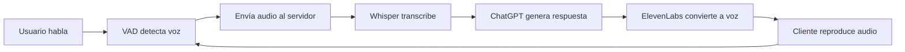

# 🎙️ H.E.L.E.N - Asistente Virtual con IA

> **H**erramienta **E**lectrónica de **L**lamadas, **E**ventos y **N**otificaciones

Conversa naturalmente con IA mediante voz, sin clicks ni comandos complejos.


---

## 🌟 ¿Qué es H.E.L.E.N?

H.E.L.E.N es un **asistente virtual impulsado por IA** que te permite mantener conversaciones naturales simplemente hablando. No necesitas presionar botones ni escribir: hablas, ella escucha, piensa y responde con voz.

### ✨ Características Principales

- 🎤 **Conversación por Voz**: Habla naturalmente como con una persona
- 🤖 **IA Conversacional**: Powered by GPT-4 para respuestas inteligentes
- 🔄 **Detección Automática**: VAD (Voice Activity Detection) detecta cuándo hablas
- 🎵 **Voz Natural**: Text-to-Speech de alta calidad con ElevenLabs
- 🎨 **Interfaz Visual Interactiva**: Esfera 3D y partículas reactivas al audio
- ⚡ **Tiempo Real**: WebSocket para comunicación instantánea

---

## 🚀 Inicio Rápido

### Prerequisitos

- Node.js >= 20.0.0
- npm >= 9.0.0
- Cuentas en:
  - [OpenAI](https://platform.openai.com/) (Whisper + GPT-4)
  - [ElevenLabs](https://elevenlabs.io/) (Text-to-Speech)

### Instalación

1. **Clonar el repositorio**
```bash
git clone https://github.com/AndreSaul16/H.E.L.E.N.git
cd H.E.L.E.N
```

2. **Instalar dependencias**
```bash
npm install
```

3. **Configurar variables de entorno**

Crea un archivo `.env` en la raíz:

```env
# OpenAI
OPENAI_API_KEY=sk-...
OPENAI_ASSISTANT_ID=asst_...

# ElevenLabs
ELEVENLABS_API_KEY=...
ELEVENLABS_VOICE_ID=qHkrJuifPpn95wK3rm2A

# Server
PORT=4000
```

4. **Ejecutar**
```bash
npm run dev:full
```

5. **Abrir en el navegador**
```
http://localhost:5173
```

---

## 🎮 Cómo Usar

1. **Click en la esfera** para iniciar
2. **Habla** cuando se encienda el micrófono
3. **Espera** la respuesta de H.E.L.E.N
4. **Continúa la conversación** automáticamente
5. **Click nuevamente** para detener

### Demo Visual

```
Click en esfera → 🎤 Micrófono activo
      ↓
Hablas → 💬 "Hola, ¿cómo estás?"
      ↓
H.E.L.E.N responde → 🔊 "¡Hola! Muy bien, gracias..."
      ↓
Continúa automáticamente → 🔄
```

---

## 📚 Documentación

### Para Todos
- **[GUIA_PEDAGOGICA.md](./GUIA_PEDAGOGICA.md)**  
  Explicación completa para no técnicos con analogías y ejemplos

### Para Desarrolladores
- **[ARCHITECTURE.md](./ARCHITECTURE.md)**  
  Documentación técnica completa del sistema

### Planificación
- **[ROADMAP.md](./ROADMAP.md)**  
  Hoja de ruta y próximas características

---

## �️ Stack Tecnológico

### Frontend
- **Vite** - Build tool
- **Vanilla JavaScript** - Sin frameworks
- **Socket.IO Client** - WebSocket
- **@ricky0123/vad-web** - Voice Activity Detection
- **GSAP** - Animaciones
- **Web Audio API** - Procesamiento de audio

### Backend
- **Node.js + Express** - Servidor
- **Socket.IO** - WebSocket server
- **OpenAI SDK** - Whisper (STT) + GPT-4
- **ElevenLabs SDK** - Text-to-Speech

---

## 🏗️ Estructura del Proyecto

```
H.E.L.E.N/
├── backend/              # Servidor Node.js
│   ├── server.js        # Punto de entrada
│   ├── routes/          # WebSocket handlers
│   └── services/        # OpenAI, ElevenLabs
├── frontend/            # Aplicación web
│   ├── index.html       # Página principal
│   ├── app.js          # Lógica + coordinación
│   ├── audioCapture.js  # Sistema VAD
│   └── *.js            # Visualización y UI
└── docs/               # Documentación
```

---

## 🎯 Flujo del Sistema



---

## 🤝 Contribuir

Las contribuciones son bienvenidas! Por favor:

1. Fork el proyecto
2. Crea tu feature branch (`git checkout -b feature/AmazingFeature`)
3. Commit tus cambios (`git commit -m 'Add some AmazingFeature'`)
4. Push a la branch (`git push origin feature/AmazingFeature`)
5. Abre un Pull Request

### Áreas de Contribución

- 🐛 **Bug fixes**
- ✨ **Nuevas características**
- 📝 **Documentación**
- 🌐 **Traducciones**
- 🎨 **Mejoras visuales**

---

## 🗺️ Roadmap

### ✅ Fase 1 (Completado)
- Sistema VAD con detección automática
- Integración con Whisper, GPT-4 y ElevenLabs
- Interfaz visual interactiva
- WebSocket bidireccional

### 🚧 Próximamente
- Agendamiento de citas (Google Calendar)
- Integración MCP (Model Context Protocol)
- Comandos de voz para automatización
- App web completa con autenticación
- Base de datos para persistencia

Ver [ROADMAP.md](./ROADMAP.md) para más detalles.

---

## � Estado del Proyecto

- ✅ **MVP Funcional**: Sistema de conversación por voz completo
- ✅ **Audio Fluido**: Reproducción sin cortes mediante buffering
- ✅ **VAD Estable**: Detección automática precisa
- ✅ **Documentación Completa**: Guías para todos los niveles
- � **Escalabilidad**: En progreso
- 🚧 **Testing**: Pendiente

---

## ⚠️ Limitaciones Conocidas

- **Requisito de HTTPS**: Para producción, WebRTC requiere HTTPS
- **Compatibilidad**: Optimizado para Chrome/Edge
- **Costos**: Uso de APIs de pago (OpenAI, ElevenLabs)
- **Latencia**: ~3-7 segundos por ciclo completo

---

## 🐛 Problemas Comunes

### El micrófono no funciona
- Verifica permisos en el navegador
- Usa HTTPS en producción
- Comprueba que el micrófono esté conectado

### Audio entrecortado
- Aumenta `MIN_CHUNK_SIZE` en `socketHandler.js`
- Verifica la conexión a internet
- Reduce la calidad de voz en ElevenLabs

### VAD muy sensible
- Ajusta `positiveSpeechThreshold` en `audioCapture.js`
- Aumenta `SILENCE_THRESHOLD` para evitar cortes

Ver [GUIA_PEDAGOGICA.md](./GUIA_PEDAGOGICA.md#-solución-de-problemas-comunes) para más soluciones.

---

## 📜 Licencia

Este proyecto está bajo la Licencia MIT. Consulta el archivo [LICENSE](./LICENSE) para más detalles.

```
MIT License

Copyright (c) 2024 André Saúl

Permission is hereby granted, free of charge, to any person obtaining a copy
of this software and associated documentation files (the "Software"), to deal
in the Software without restriction, including without limitation the rights
to use, copy, modify, merge, publish, distribute, sublicense, and/or sell
copies of the Software, and to permit persons to whom the Software is
furnished to do so, subject to the following conditions:

[...]
```

---

## 👤 Autor

**André Saúl**
- GitHub: [@AndreSaul16](https://github.com/AndreSaul16)
- Proyecto: H.E.L.E.N (Herramienta Electrónica de Llamadas, Eventos y Notificaciones)

---

## 🙏 Agradecimientos

- **OpenAI** - Whisper STT y GPT-4
- **ElevenLabs** - Text-to-Speech de alta calidad
- **@ricky0123** - Librería VAD
- **GreenSock (GSAP)** - Motor de animaciones
- **Comunidad Open Source** - Por las herramientas increíbles

---

## 💡 Inspiración

H.E.L.E.N nació de la curiosidad por crear una forma más natural de interactuar con la IA. En lugar de escribir, ¿por qué no simplemente hablar?

El proyecto evolucionó desde un concepto simple de recepcionista virtual hasta un asistente conversacional completo, demostrando cómo las APIs modernas de IA pueden combinarse para crear experiencias únicas.

---

## 📞 Soporte

¿Tienes preguntas o problemas?

1. **Revisa la documentación**:
   - [Guía Pedagógica](./GUIA_PEDAGOGICA.md) para conceptos básicos
   - [Architecture](./ARCHITECTURE.md) para detalles técnicos

2. **Busca en Issues**: Puede que alguien ya haya tenido el mismo problema

3. **Abre un Issue**: Describe tu problema detalladamente

4. **Discusiones**: Para preguntas generales o ideas

---

⭐ **Si este proyecto te resulta útil, considera darle una estrella en GitHub!**

---

<div align="center">

**Hecho con ❤️ y mucha ☕**

[Reportar Bug](https://github.com/AndreSaul16/H.E.L.E.N/issues) · [Solicitar Feature](https://github.com/AndreSaul16/H.E.L.E.N/issues) · [Contribuir](./CONTRIBUTING.md)

</div>
