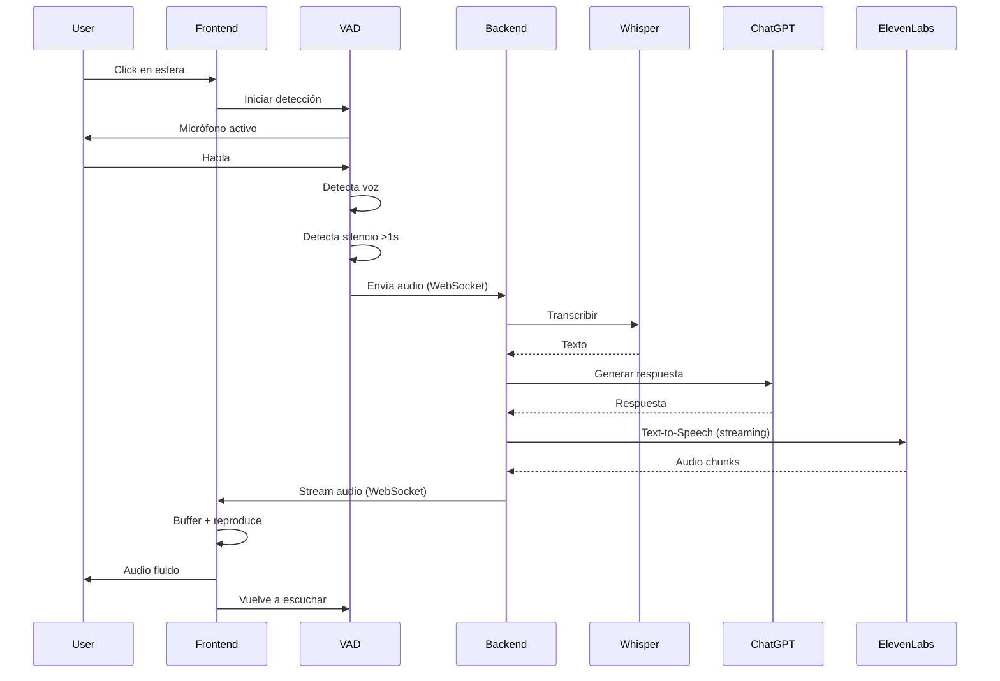

# 🎙️ H.E.L.E.N 2.0 - Voice AI Assistant

**H**uman **E**nhanced **L**istening & **E**ngagement **N**etwork

Una asistente de voz impulsada por IA con detección automática de voz (VAD), streaming en tiempo real y visualización interactiva de audio.


## ✨ Características

### 🎯 Core Features
- **🎤 VAD (Voice Activity Detection)**: Detección automática de voz sin necesidad de mantener botones presionados
- **🔄 Streaming Bidireccional**: WebSocket con Socket.IO para comunicación en tiempo real
- **🗣️ Conversación Continua**: Flujo automático sin interrupciones manuales
- **🎵 Audio Fluido**: Sistema de buffering para reproducción sin cortes

### 🤖 Integración de IA
- **Whisper (OpenAI)**: Transcripción de voz a texto en español
- **ChatGPT Assistants API**: Conversación inteligente con contexto
- **ElevenLabs**: Text-to-Speech con voz multilingüe de alta calidad

### 🎨 Interfaz Visual
- **Esfera 3D Interactiva**: Animada con GSAP
- **Sistema de Partículas**: Reacciona al audio en tiempo real
- **AudioVisualizer**: Visualización espectral del audio
- **Animaciones Fluidas**: transiciones suaves con GSAP

## 🚀 Inicio Rápido

### Prerequisitos

```bash
node >= 20.0.0
npm >= 9.0.0
```

### Instalación

1. **Clonar el repositorio:**
```bash
git clone https://github.com/AndreSaul16/H.E.L.E.N.git
cd H.E.L.E.N
```

2. **Instalar dependencias:**
```bash
npm install
```

3. **Configurar variables de entorno:**

Crea un archivo `.env` en la raíz del proyecto:

```env
# OpenAI (Whisper + ChatGPT)
OPENAI_API_KEY=sk-...
OPENAI_ASSISTANT_ID=asst_...

# ElevenLabs (TTS)
ELEVENLABS_API_KEY=...
ELEVENLABS_VOICE_ID=qHkrJuifPpn95wK3rm2A

# Server Config
PORT=4000
```

### Ejecutar

**Modo desarrollo (backend + frontend):**
```bash
npm run dev:full
```

O ejecutar por separado:

```bash
# Terminal 1 - Backend
npm run dev

# Terminal 2 - Frontend
npm run dev:vite
```

Abrir en el navegador: `http://localhost:5173`

## 📁 Estructura del Proyecto

```
H.E.L.E.N-version-2.0-preview/
├── backend/
│   ├── server.js                 # Servidor principal
│   ├── routes/
│   │   └── socketHandler.js      # Manejo de WebSocket
│   └── services/
│       ├── WhisperService.js     # STT con OpenAI Whisper
│       ├── ChatGPTService.js     # IA conversacional
│       └── ElevenLabsService.js  # TTS con streaming
├── frontend/
│   ├── index.html                # Página principal
│   ├── app.js                    # Lógica principal + VAD
│   ├── audioCapture.js           # Sistema VAD
│   ├── audioVisualizer.js        # Visualización de audio
│   ├── particleSystem.js         # Sistema de partículas
│   └── styles.css                # Estilos
├── .env                          # Variables de entorno (no incluido)
├── .gitignore
├── package.json
└── README.md
```

## 🎮 Cómo Usar

1. **Iniciar conversación**: Click en la esfera central
2. **Hablar**: El VAD detecta automáticamente cuando hablas
3. **Esperar respuesta**: La IA procesa y responde con voz
4. **Continuar**: La conversación continúa automáticamente
5. **Detener**: Click nuevamente para finalizar

## 🔧 Tecnologías

### Frontend
- **Vite**: Build tool y dev server
- **GSAP**: Animaciones
- **Socket.IO Client**: WebSocket
- **@ricky0123/vad-web**: Voice Activity Detection
- **SimplexNoise**: Generador de ruido para partículas
- **Web Audio API**: Procesamiento y visualización de audio

### Backend
- **Node.js + Express**: Servidor HTTP
- **Socket.IO**: WebSocket server
- **OpenAI SDK**: Whisper + GPT-4
- **ElevenLabs SDK**: Text-to-Speech
- **FormData + Blob**: Manejo de audio
- **Multer**: Procesamiento de archivos

## 📊 Flujo de la Aplicación



## 🎯 Características Técnicas Destacadas

### Voice Activity Detection (VAD)
- Modelo Silero VAD (ONNX)
- Detección en tiempo real (frames de 30ms)
- Threshold configurable: 0.5
- Silence detection: 1000ms
- Automatic commit on silence

### Audio Streaming
- **Buffering inteligente**: Combina chunks pequeños (>1000 bytes)
- **Reproducción continua**: Un solo AudioBuffer para evitar gaps
- **Visualización reactiva**: Partículas sincronizadas con audio
- **Latencia reducida**: ~9 segundos hasta primer audio

### WebSocket Architecture
- **Eventos bidireccionales**:
  - `audio-data`: Cliente → Servidor (audio capturado)
  - `transcript`: Servidor → Cliente (texto transcrito)
  - `response`: Servidor → Cliente (respuesta de IA)
  - `audio-chunk`: Servidor → Cliente (chunks de TTS)
  - `audio-end`: Servidor → Cliente (fin de streaming)
  - `status`: Servidor → Cliente (estados del proceso)

## 🐛 Debugging

El proyecto incluye logging extensivo. Abre la consola del navegador (F12) para ver:

```
🎙️ [VAD] - Voice Activity Detection
📦 [WEBSOCKET] - Eventos de WebSocket
▶️ [PLAYBACK] - Reproducción de audio
📤 [SEND] - Envío de datos
🎼 - Decodificación de audio
```

## 📝 Notas

- **Requisito de HTTPS**: Para producción, WebRTC/getUserMedia requiere HTTPS
- **Permisos de micrófono**: El navegador solicitará permiso en el primer uso
- **Costo de APIs**: Ten en cuenta los costos de OpenAI y ElevenLabs
- **Browser compatibility**: Chrome/Edge recomendados (Web Audio API + WASM)

## 🤝 Contribuir

Las contribuciones son bienvenidas. Por favor:

1. Fork el proyecto
2. Crea una branch (`git checkout -b feature/AmazingFeature`)
3. Commit tus cambios (`git commit -m 'Add: Amazing Feature'`)
4. Push a la branch (`git push origin feature/AmazingFeature`)
5. Abre un Pull Request

## 📜 Licencia

Este proyecto está bajo la Licencia MIT.

## 👤 Autor

**André Saúl**
- GitHub: [@AndreSaul16](https://github.com/AndreSaul16)

## 🙏 Agradecimientos

- OpenAI por Whisper y GPT-4
- ElevenLabs por su API de TTS
- @ricky0123 por la librería VAD
- GreenSock (GSAP) por las animaciones

---

⭐ Si este proyecto te ha sido útil, considera darle una estrella en GitHub!
